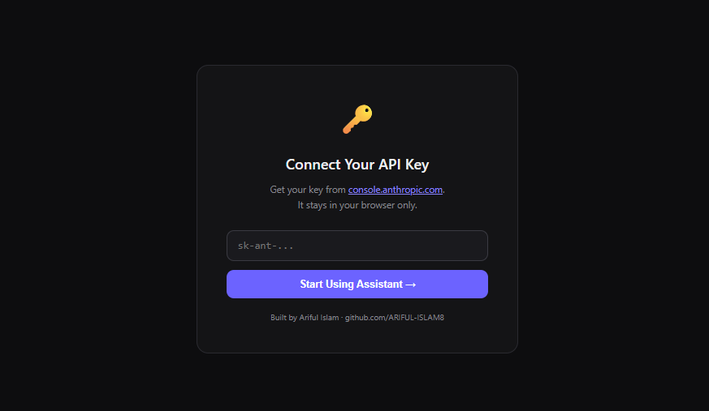
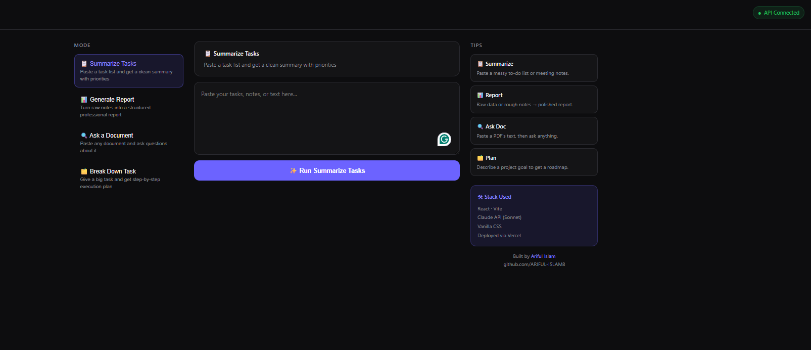

# ⚡ AI Task Assistant
> Built by Ariful Islam | [github.com/ARIFUL-ISLAM8](https://github.com/ARIFUL-ISLAM8)





## 📖 Overview

**AI Task Assistant** is a powerful, client-side productivity application built with **React + Vite** that seamlessly integrates the **Claude API (Anthropic)** to streamline your daily workflow. It eliminates the need for complex prompt engineering by offering four specialized modes tailored for common tasks. 

Everything runs directly in your browser without requiring a backend server. Your API key is stored locally in your browser session and is never sent anywhere except directly to Anthropic's secure endpoints.

---

## ✨ Key Features

The application supports four distinct, optimized modes:

1. 📋 **Summarize Tasks** 
   - *Use Case:* Paste messy to-do lists, meeting notes, or unstructured brain dumps.
   - *Output:* Get a clean, categorized, and prioritized summary highlighting what you need to tackle first.

2. 📊 **Generate Report** 
   - *Use Case:* Turn raw data, research notes, or scattered thoughts into a polished document.
   - *Output:* A structured professional report complete with an Executive Summary, Key Points, Details, and Recommendations.

3. 🔍 **Ask a Document** 
   - *Use Case:* Paste the text of any article, PDF, or document, and ask specific questions about it.
   - *Output:* Accurate answers based *only* on the provided text, with quotes when helpful.

4. 🗂️ **Break Down Task** 
   - *Use Case:* Describe a large, overwhelming project or goal.
   - *Output:* A practical, step-by-step execution roadmap including time estimates, required resources, and potential blockers.

**Additional Features:**
- 🕒 History of your last 5 runs for quick reference.
- 📋 One-click copy output to clipboard.
- 🔒 Secure, in-browser API key management.
- 🎨 Sleek, responsive, custom dark-theme UI.

---

## 🛠 Tech Stack

| Layer     | Technology                  |
|-----------|-----------------------------|
| **Frontend**  | React 18, Vite              |
| **AI Engine** | Claude Sonnet 3.5 (Anthropic)|
| **Styling**   | Custom Vanilla CSS (Dark Theme) |
| **Deployment**| Vercel                      |

---

## 🚀 Run Locally (3 steps)

### 1. Install dependencies
```bash
npm install
```

### 2. Start the development server
```bash
npm run dev
```

### 3. Open your browser
Navigate to:
```
http://localhost:3000
```

*Note: You will be prompted to enter your Anthropic API key on the first screen. You can obtain one from the [Anthropic Console](https://console.anthropic.com).*

---

## 🌐 Deploy to Vercel (Free)

Since this is a fully client-side Vite app, it can be hosted easily for free on Vercel.

### Option A — Vercel CLI
```bash
npm install -g vercel
vercel
```

### Option B — GitHub + Vercel Dashboard
1. Push this folder to a GitHub repository.
2. Go to [Vercel](https://vercel.com) and click **New Project**.
3. Import your repository and click **Deploy**.
4. Done! Your live URL will be ready in ~60 seconds.

---

## 📁 Project Structure

```
ai-task-assistant/
├── src/
│   ├── App.jsx        # Main application component & API logic
│   ├── main.jsx       # React entry point
│   └── index.css      # Global design tokens and styles
├── image/             # Project screenshots
├── index.html         # Main HTML template
├── package.json       # Dependencies and scripts
├── vite.config.js     # Vite configuration
└── vercel.json        # Vercel deployment config
```
